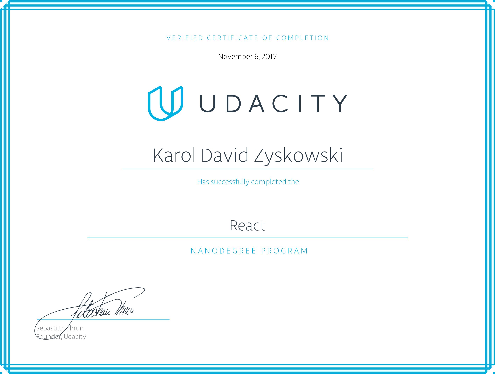

# React Nanodegree Certificate

## Projects

* [Mobile Flashcards](https://github.com/karoldavid/flashcard): Study Flashcards App

Build with create-react-native-app, uses Redux and Redux Thunk

* [Readable](https://github.com/karoldavid/readable): Content Web App

Build with create-react-app, uses Redux and Redux Thunk

* [My Reads](https://github.com/karoldavid/myreads): Book Traching App

Build with create-react-app

## Author

* **Karol Zyskowski**

Questions? Send an email to: k.zysk@zoho.com

## Acknowledgments

* https://www.udacity.com/course/react-nanodegree--nd019
